DataGenerator
=============

[](https://travis-ci.com/edouardfouche/DataGenerator)
[](https://github.com/edouardfouche/DataGenerator/blob/master/LICENSE.md)

A bunch of little data generators to simulate multivariate dependencies, written in scala.

## Quick Start

The framework can either be used from the an external command line or embedded into other Scala projects.

## Command line usage


### Build it and run it

**Requirements** : ([Oracle JDK 8](https://www.oracle.com/technetwork/java/javase/downloads/jdk8-downloads-2133151.html) or [OpenJDK 8](http://openjdk.java.net/install/)) and [sbt](https://www.scala-sbt.org/1.0/docs/Setup.html)

The project is built with sbt (version 1.2.8). You can compile, package or run the project as follows:

```
sbt compile
sbt package
sbt "run <arguments>"
```

You can also export a "fat" jar, including all dependencies and scala libraries using [`sbt-assembly`](https://github.com/sbt/sbt-assembly):

```
sbt assembly
```

This creates a jar in the folder `target/scala-2.12/` named `DataGenerator-<version>.jar`, which can be run from java (no
sbt/scala installation required). You can call the jar with various parameters to generate sample or arbitrary size and
dimensionality as follows:


```
java -jar target/scala-2.12/DataGenerator-<version>.jar <parameters>
```

Hereafter, we detail the parameters and give examples. Arguments are given in any order and are not case sensitive.
Calling the jar typically outputs `.csv` and/or `.png` files in a specified path or the current repository.
Files are named by default as follows:

```
<generator_name>-<generator_shortname><_generator_specificparameter(if applicable)>-<number_of_dimensions>-<noise_level>-<noise_type>-<discrete_levels>.<csv/png>
```  

Parameters
----------

`-g`: generator to be used. Can be either the name or shortname of the generator. Not case sensitive. The package currently supports over 20 generators. If `-g` is not provided then ALL generator will be used with the given parameters.

`-n`: number of observations, default 1000.

`-d`: number of dimensions, default 2.

`-noise`: noise level, typically between 0 and 1. In the case of a `gaussian` noise, the noise level is the standard deviation of the gaussian distribution used, i.e., N(0,noise). In the case of a `uniform` noise, it is the maximal amplitude of the noise, i.e., U(-noise/2, noise/2). Default 0 (= no noise). 

`-ntype`: noise type, either `gaussian` or `uniform`. Default `gaussian`. 

`-disc`: discretization levels, int > 0. The value is the number of unique value on each axis. Default 0 (= no discretization). 

`-s`: special parameter for the generator. Some generator are parameterized (scale, period, number of steps). If not provided, the generator will use its default special parameter (if any). See the document for each generator. 

`-a`: action to perform, can be `write`, `plot` or `both`. If `write` then the data is written to a `.csv` file at the given path or current directory. If `plot` then the data is plotted in a `.png` (supported only for 2Dand 3D data). If `both`, then both actions are performed. Default `write`.

`-p`: path where to save the output. Default is the current directory. 

`-o`: name of the output file. Default name is as described above

`--verbose`: If added, toggle the output of debugging statements.

Examples
--------

Plot all two and three dimensional dependencies with default configuration (can be useful to check each dependency) 

```
java -jar target/scala-2.12/DataGenerator-0.1.0.jar -d 2 -a plot --verbose
java -jar target/scala-2.12/DataGenerator-0.1.0.jar -d 3 -a plot --verbose
```

Write and plot a noisy sphere (3 dimensions) at the indicated location.

```
java -jar target/scala-2.12/DataGenerator-0.1.0.jar -g hypersphere -n 2000 -d 3 -noise 0.1 -a both -p /home/<user>/<whereyouwant>
```

You can also use the corresponding short name. 

```
java -jar target/scala-2.12/DataGenerator-0.1.0.jar -g hs -d 3 -noise 0.1 -a both -p /home/<user>/<whereyouwant>
```

## In-code usage

### Import it

The data generator is available on the central repository (scala 2.11 and 2.12).

You can add it as a dependency in your own project, for example, via sbt:

```
libraryDependencies += "io.github.edouardfouche" %% "datagenerator" % "0.1.0"
```

### Use it

See [src/main/scala/io/github/edouardfouche/incode_usage/example.sc](src/main/scala/io/github/edouardfouche/incode_usage/example.sc) 
for an example of in-code usage.

Generators
----------

Here we illustrate each supported generator. All illustrations are made via a jupyter notebook calling the `.jar`, see `visualize.ipynb`  

**Cross - cr**

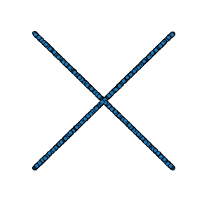 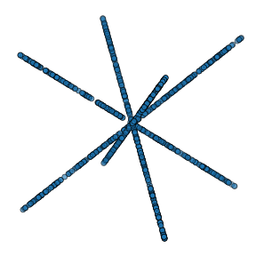

**Cubic - cu**

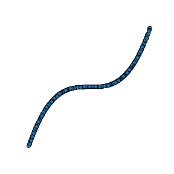  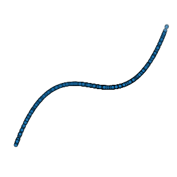 

special parameter: `scale`, default 1

**DoubleLinear - dl**

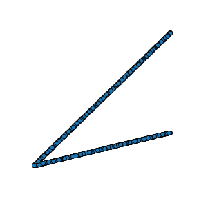  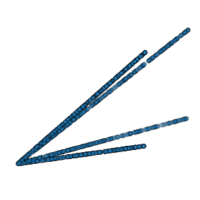

special parameter: `coef`, default 0.25

**Hourglass - ho**

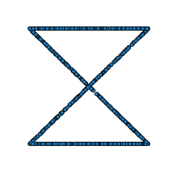  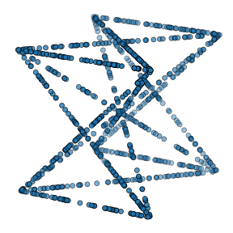 

**Hypercube - hc**

  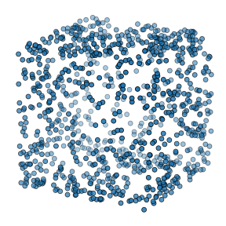 

**HypercubeGraph - hcg**

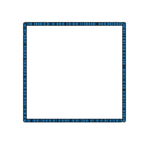  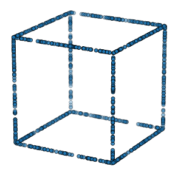 

**Hypersphere - hs**

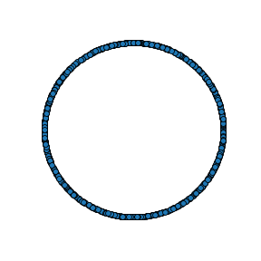  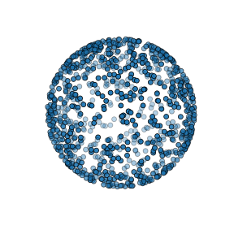 

**Independent - i**

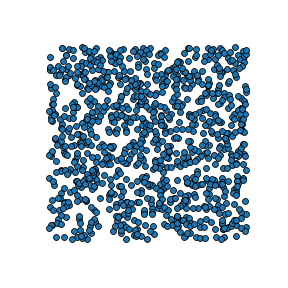  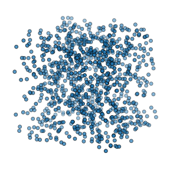 

**Linear - l**

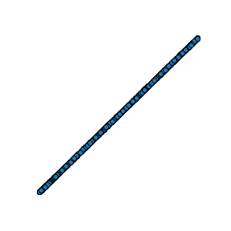  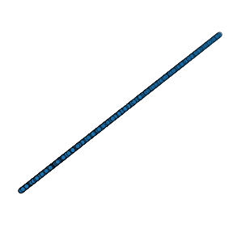 

**LinearPeriodic - lp**

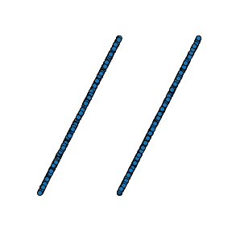  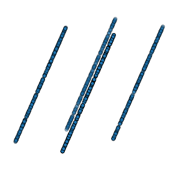 

special parameter: `period`, default 2

**LinearStairs - lsa**

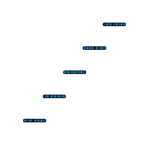  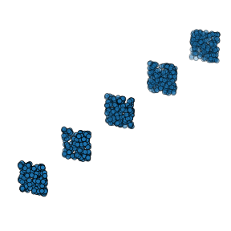 

special parameter: `nstep`, default 5

**LinearSteps - lse**

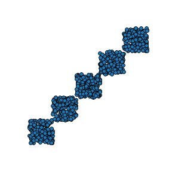  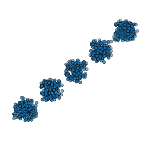 

special parameter: `nstep`, default 5

**LinearThenDummy - ltd**

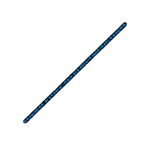  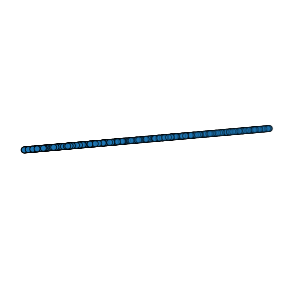 

**LinearThenNoise - ltn**

  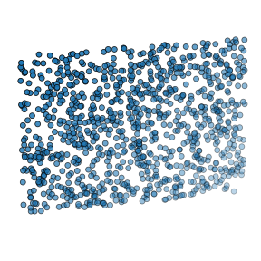 

**NonCoexistence - nc**

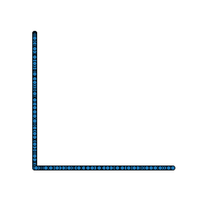  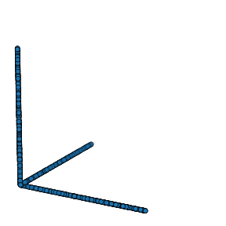 

**Parabola - p**

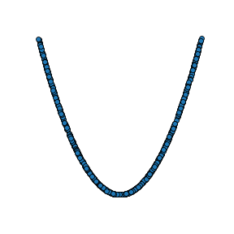  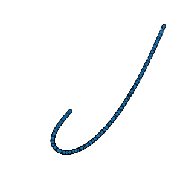 

special parameter: `scale`, default 1

**RandomSteps - rs**

special parameter: `nstep`, default 5

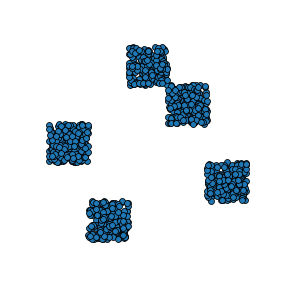  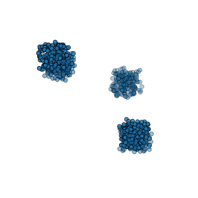 

**Root - ro**

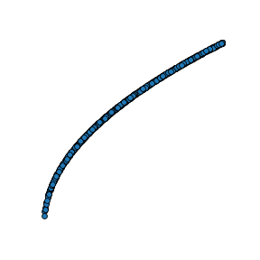  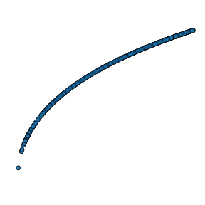 

special parameter: `scale`, default 1

**Sine - si**

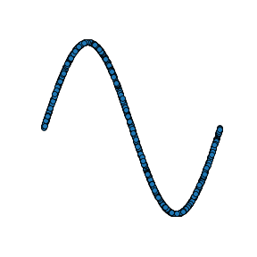  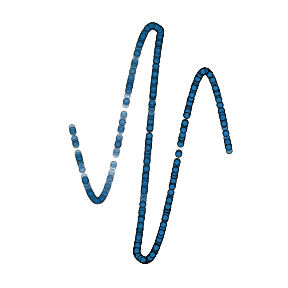 

special parameter: `period`, default 1

**Star - st**

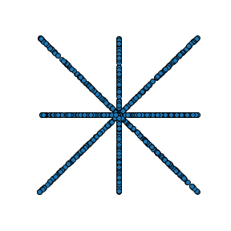 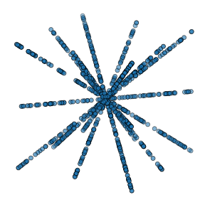

**StraightLines - st**

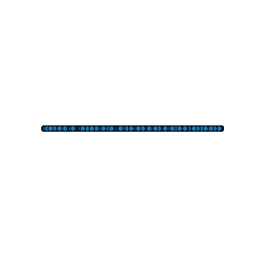 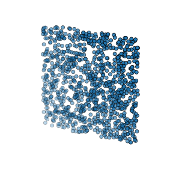

**Zinv - Zi**

 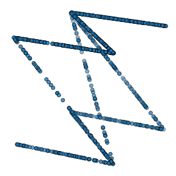

**Z - z**

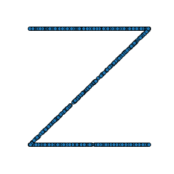 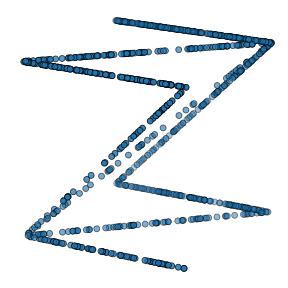

Adding noise
------------

Each data generator is normalized between 0 and 1, after generation, you can add an arbitrary amount of noise to each dependency. Two types of noise are currently supported: 'gaussian' (default) and 'uniform'. 

The amount of noise is quantified by a 'noise level' > 0, in the case of a 'gaussian' noise, it is the standard deviation of the gaussian distribution used to generate the noise. In the case of 'uniform' noise, it is the amplitude of the noise. While we accept noise level > 1, this may not be useful as the data is normalized between 0 and 1 before noise, thus a noise level of 1 is already quite high. Note that a noise level of 0 means no noise. 

**Gaussian noise [0, 0.1, 0.2, 0.4, 0.8, 1.0]**

 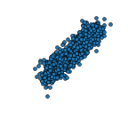 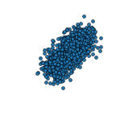 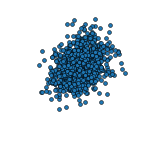 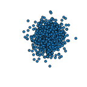 

**Uniform noise [0, 0.1, 0.2, 0.4, 0.8, 1.0]**

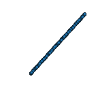 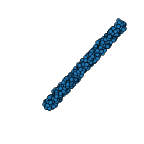 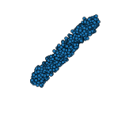   

As we can see, the gaussian noise is slightly more 'aggressive'.

Discretization
--------------

After adding noise (or not) you can discretize the output to a specific number of value per dimensions ('discretization level'). 

**Discretization [100, 50, 10, 3, 2, 1]**

     

Contributing
------------

You want to add your own generator? That's great !! You'd just need to do the following: 
- Create a `case class YourGenerator` extending trait `DataGenerator` or `ParameterizedDataGenerator`
- Give it a `val name` and implement `getPoints(n: Int): Array[Array[Double]]` 
    - In the case of a `ParameterizedDataGenerator`, you need to handle the additional parameter. 
- Give your generator a shortname in GeneratorFactory.correspondances and add it to GeneratorFactory.get
- Open a pull request :) 

